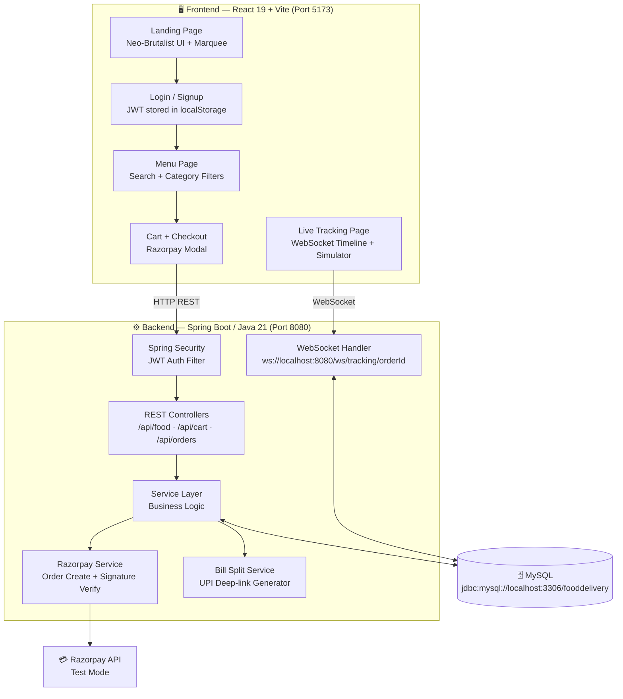

<div align="center">

# 🍔 BiteDash

### *Food so fast, it practically bites back.*

**A next-generation full-stack food delivery web app with a Neo-Brutalist UI, Razorpay payments, and real-time WebSocket order tracking — built for speed, boldness, and flavour.**

<br/>


</div>

---

## 🌟 Core Features

### 🎨 Interactive Neo-Brutalist UI
A bold, unapologetic design language with thick black borders, heavy offset box shadows (`shadow-[6px_6px_0px_#19140f]`), flat retro cards, and expressive display typography. The landing page features a **3D mouse-tilt animated hamburger asset** and a **looping scrolling marquee** — this UI *demands* attention. Custom fonts used: **Archivo Black** for headers, **Space Grotesk** for body copy.

### 🔍 Dynamic Menu Search & Filtering
A real-time search box on the menu page lets users find items instantly. **Category pills** ("All", "Burgers", "Pizza", "Desserts", "Drinks", "Biryani") filter the menu without any page reload — snappy, instant, smooth.

### 💳 Razorpay Payment Integration
Checkout is handled via a sleek **interactive modal popup overlay** powered by Razorpay's test mode SDK. Order tokens are generated server-side and Razorpay's signature is **verified before any order is committed to the database** — no payment, no order.

### 📡 WebSocket Live Order Tracking
A live order status timeline (`Placed → Preparing → Out for Delivery → Delivered`) updates in **real time** via a Spring WebSocket connection. A built-in **tracking simulator dashboard** on the frontend lets you push mock GPS coordinates to the server and watch the UI update instantly.

### 🤝 Bill Splitting Service
BiteDash has a built-in bill splitter — enter multiple UPI IDs at checkout, and the app calculates the **per-person share**, generating a **UPI deep-link** (`upi://pay?pa=...`) for each person. Works with GPay, PhonePe, Paytm, BHIM, and all major UPI apps.

---

## 🛠️ Technology Stack

### 🖥️ Frontend
| Technology | Details |
|---|---|
| **Framework** | React 19 + Vite 8 (JSX + React Router v7) |
| **Styling** | Tailwind CSS v4 (configured with Vite compiler plugin) |
| **Design Language** | Custom Neo-Brutalist — thick borders, offset shadows, flat retro cards |
| **Typography** | Archivo Black (headers) · Space Grotesk (body) |
| **State Management** | React Context API (`CartContext`) |
| **Auth Storage** | JWT tokens via `localStorage` |

### ⚙️ Backend
| Technology | Details |
|---|---|
| **Framework** | Spring Boot (Java 21) with Maven |
| **Database** | MySQL — JPA / Hibernate ORM |
| **Security** | JWT-based authentication using `jjwt 0.12.6` — stateless auth |
| **Real-Time** | Native Spring WebSocket — raw `TextWebSocketHandler` |
| **Payments** | Razorpay SDK — server-side order creation + signature verification |
| **Build Tool** | Maven 3.6+ |
| **Server** | Embedded Apache Tomcat (port `8080`) |

---

## 🏗️ System Architecture



---

## 📁 Project Folder Structure

```
BiteDash/
│
├── 📂 frontend/                          # React + Vite Application
│   ├── public/
│   │   └── assets/                       # Static images, icons, mascot SVGs
│   ├── src/
│   │   ├── components/
│   │   │   ├── Navbar.jsx                # Neo-Brutalist sticky navbar
│   │   │   ├── Mascot.jsx                # Animated SVG chili-pepper mascot
│   │   │   ├── CategoryPills.jsx         # Filter pills for menu page
│   │   │   └── MarqueeTicker.jsx         # Looping scrolling marquee
│   │   ├── context/
│   │   │   └── CartContext.jsx           # Global cart state
│   │   ├── pages/
│   │   │   ├── LandingPage.jsx           # Hero + 3D tilt hamburger
│   │   │   ├── LoginPage.jsx
│   │   │   ├── SignupPage.jsx
│   │   │   ├── MenuPage.jsx              # Search + filter + food grid
│   │   │   ├── CartPage.jsx
│   │   │   ├── CheckoutPage.jsx          # Razorpay modal + bill split input
│   │   │   └── TrackingPage.jsx          # WebSocket timeline + simulator
│   │   ├── index.css                     # Tailwind v4 @theme tokens
│   │   └── main.jsx                      # App entry point
│   ├── index.html
│   ├── vite.config.js
│   └── package.json
│
└── 📂 backend/                           # Spring Boot Application
    └── src/main/java/com/bitedash/
        ├── BiteDashApplication.java       # Entry point
        ├── model/
        │   ├── User.java
        │   ├── FoodItem.java
        │   ├── Cart.java / CartItem.java
        │   ├── Order.java / OrderItem.java
        ├── repository/                    # Spring Data JPA interfaces
        ├── dto/                           # Request & Response DTOs
        ├── service/
        │   ├── AuthService.java           # JWT generation + validation
        │   ├── FoodService.java
        │   ├── CartService.java
        │   ├── OrderService.java
        │   ├── RazorpayService.java       # Payment order + verification
        │   └── BillSplitService.java      # UPI deep-link generator
        ├── controller/                    # REST API controllers
        ├── websocket/
        │   └── TrackingWebSocketHandler.java
        ├── config/
        │   ├── SecurityConfig.java        # JWT filter chain
        │   ├── WebSocketConfig.java
        │   └── DataSeeder.java            # Demo data auto-seeder
        └── resources/
            └── application.properties
```

---

## 🚀 Setup & Installation

### ✅ Prerequisites

| Tool | Minimum Version | Download |
|---|---|---|
| **Java JDK** | 21+ | [adoptium.net](https://adoptium.net) |
| **Maven** | 3.6+ | [maven.apache.org](https://maven.apache.org) |
| **Node.js** | 18+ | [nodejs.org](https://nodejs.org) |
| **MySQL** | 8.0+ | [mysql.com](https://dev.mysql.com) |
| **Git** | Any | [git-scm.com](https://git-scm.com) |

---

### 🗄️ Step 1 — Database Setup

```sql
-- Log into MySQL and run:
CREATE DATABASE fooddelivery;
```

---

### ⚙️ Step 2 — Backend Setup

```bash
# 1. Navigate to the backend folder
cd BiteDash/backend

# 2. Open src/main/resources/application.properties
#    and configure your credentials:
```

```properties
# ── Database ──────────────────────────────────────────────
spring.datasource.url=jdbc:mysql://localhost:3306/fooddelivery
spring.datasource.driver-class-name=com.mysql.cj.jdbc.Driver
spring.datasource.username=root
spring.datasource.password=yourpassword

# ── JPA / Hibernate ──────────────────────────────────────
spring.jpa.hibernate.ddl-auto=update
spring.jpa.show-sql=true

# ── Server ───────────────────────────────────────────────
server.port=8080

# ── JWT ──────────────────────────────────────────────────
jwt.secret=your_super_secret_key_here
jwt.expiration=86400000

# ── Razorpay ─────────────────────────────────────────────
razorpay.key.id=rzp_test_XXXXXXXXXXXXXXXX
razorpay.key.secret=your_razorpay_test_secret
```

```bash
# 3. Build and start the backend
mvn clean install -DskipTests
mvn spring-boot:run

# ✅ Backend is live at http://localhost:8080
```

> 💡 **Tip:** On startup, `DataSeeder.java` auto-populates the database with **3 demo users** and **13 food items** across 5 categories if the tables are empty.

---

### 🖥️ Step 3 — Frontend Setup

```bash
# 1. Navigate to the frontend folder
cd BiteDash/frontend

# 2. Install dependencies
npm install

# 3. Create a .env file in the root of /frontend
```

```env
VITE_API_BASE_URL=http://localhost:8080
VITE_RAZORPAY_KEY_ID=rzp_test_XXXXXXXXXXXXXXXX
```

```bash
# 4. Start the dev server
npm run dev

# ✅ Frontend is live at http://localhost:5173
```

---

## 🧪 Testing & Running the App

### 🔁 Full Demo Flow

| Step | Action | Endpoint / URL |
|---|---|---|
| 1️⃣ | Browse the menu | `GET /api/food` |
| 2️⃣ | Register / Login | `POST /api/users/register` |
| 3️⃣ | Add items to cart | `POST /api/cart/add` |
| 4️⃣ | Checkout with Razorpay | Open `http://localhost:5173/checkout` |
| 5️⃣ | View bill split & UPI links | `GET /api/orders/{orderId}/bill-split` |
| 6️⃣ | Connect WebSocket tracker | `ws://localhost:8080/ws/tracking/{orderId}` |
| 7️⃣ | Push mock GPS via simulator | `PUT /api/orders/{orderId}/tracking` |
| 8️⃣ | Complete the order | `PUT /api/orders/{orderId}/status?status=DELIVERED` |

---

### 💳 Testing Razorpay Payments

1. Obtain your **Razorpay Test Mode** Key ID and Secret from [dashboard.razorpay.com](https://dashboard.razorpay.com).
2. Set both values in `application.properties` and `.env` as shown above.
3. At checkout, the Razorpay modal will open — use the **test card** details below:

```
Card Number : 4111 1111 1111 1111
Expiry      : Any future date
CVV         : Any 3 digits
OTP         : 1234
```

> ✅ On successful payment, the backend **verifies the Razorpay signature** before saving the order to the database.

---

### 📡 Testing WebSocket Live Tracking

**Option A — Browser Console** (Quick test)
```javascript
// Open http://localhost:5173 in browser, then open DevTools Console:
const ws = new WebSocket('ws://localhost:8080/ws/tracking/1');
ws.onopen    = () => console.log('🟢 Connected!');
ws.onmessage = (e) => console.log('📍 Live update:', JSON.parse(e.data));
```

**Option B — Frontend Simulator Dashboard**

Navigate to the **Tracking Page** after placing an order. Use the built-in **Delivery Simulator** panel to push mock GPS coordinates — the status timeline and map update in real time.

**Option C — Postman / cURL**
```bash
curl -X PUT http://localhost:8080/api/orders/1/tracking \
  -H "Content-Type: application/json" \
  -d '{"lat": 17.4449, "lng": 78.3498, "status": "OUT_FOR_DELIVERY"}'
```

Expected WebSocket broadcast to all connected clients:
```json
{
  "orderId": 1,
  "lat": 17.4449,
  "lng": 78.3498,
  "status": "OUT_FOR_DELIVERY"
}
```

---

### 🧾 Testing Bill Split (UPI Deep-links)

Place an order with multiple UPI IDs in the request body:
```json
POST /api/orders/place
{
  "userId": 1,
  "deliveryAddress": "Room 204, VIT-AP Hostel",
  "splitUpiIds": ["pankaj@okicici", "rahul@ybl", "priya@paytm"]
}
```

Then fetch the split:
```bash
GET http://localhost:8080/api/orders/1/bill-split
```

Each person receives a UPI deep-link like:
```
upi://pay?pa=pankaj@okicici&am=265.66&cu=INR&tn=FoodOrder%231&mc=5812
```
This link opens directly in GPay, PhonePe, Paytm, or any UPI app. 🎉

---

### 🌱 Pre-Seeded Demo Data

The following data is auto-inserted on every fresh startup:

**Users** *(default password: `pass123`)*

| Name | Email | UPI ID |
|---|---|---|
| Pankaj | pankaj@test.com | pankaj@okicici |
| Rahul | rahul@test.com | rahul@ybl |
| Priya | priya@test.com | priya@paytm |

**Food Items (13 items, 5 categories)**

| Category | Items |
|---|---|
| 🍔 Burger | Classic Beef ₹199 · Spicy Chicken ₹179 · Veggie ₹149 |
| 🍕 Pizza | Margherita ₹299 · Paneer Tikka ₹349 · BBQ Chicken ₹379 |
| 🍛 Biryani | Hyderabadi Chicken ₹249 · Veg Dum ₹199 · Mutton ₹329 |
| 🍮 Desserts | Gulab Jamun ₹69 · Chocolate Lava Cake ₹129 |
| 🥤 Drinks | Mango Lassi ₹79 · Cold Coffee ₹89 |

---

### ⚠️ Error Reference

| Status | Error | When |
|---|---|---|
| `400` | Bad Request | Empty cart, unavailable item, duplicate email, invalid status |
| `401` | Unauthorized | Missing or invalid JWT token |
| `403` | Forbidden | Spring Security blocking the route |
| `404` | Not Found | User / Order / Food item ID doesn't exist |
| `500` | Server Error | Unexpected exception — check Spring console logs |

All errors return a consistent JSON envelope:
```json
{ "error": "User not found: 99", "timestamp": "2025-06-22T10:30:00" }
```

---

## 👨‍💻 Developers & Contributors

<div align="center">

| 🧑‍💻 Name | 🎓 Role | 🏫 Institute |
|---|---|---|
| **Pankaj** | Full-Stack Developer (Frontend + Backend) | VIT-AP, Amaravati |

</div>

<div align="center">

---

*Made with 🍕, ☕, and a whole lot of `console.log()` · VIT-AP · BiteDash © 2025*

</div>
